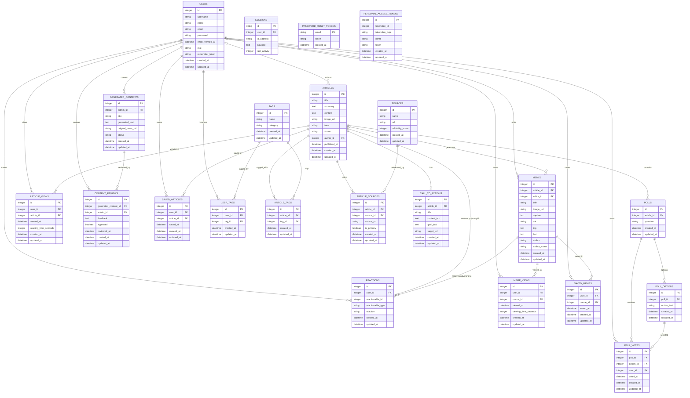

# TLE4 Project Backend

This repository contains the backend for the TLE4 project — a Laravel API-driven application providing articles, polls, memes, reactions, tags and related features.

## Table of Contents

- Project Overview
- ERD (Entity Relationship Diagram)
- Frontend Implementation
- Installation
- Deployment
- Configuration (.env)
- Usage & Testing
- Edge Cases & Decisions

## Project Overview

Impakt is a news platform that delivers news in a lighter, sometimes humorous way to help reduce pessimistic future outlooks among 18–23-year-olds in the Randstad region of the Netherlands, while still keeping them informed about important news.

## ERD (Entity Relationship Diagram)

The following Mermaid ER diagram summarizes the main entities and relationships in the system.




## Frontend Implementation (Routes and fields)

All API routes are prefixed with `http://145.24.237.97/api/`.

Use `Authorization: Bearer <token>` for protected routes after login.

Example JSON bodies below use realistic sample values. For routes with path or query parameters, the example request shows the complete URL.

### public endpoints (all users)

- `POST /api/register`
    - Required fields: `username`, `email`, `password`
    - Optional fields: `name`
    - Example request:
      ```json
      {
        "username": "julia_vermeer",
        "name": "Julia Vermeer",
        "email": "julia.vermeer@example.com",
        "password": "Str0ngPassw0rd!",
        "password_confirmation": "Str0ngPassw0rd!"
      }
      ```
    - Returns: the created `user` and auth token
- `POST /api/login`
    - Required fields: `email`, `password`
    - Optional fields: none in the current API controller
    - Example request:
      ```json
      {
        "email": "julia.vermeer@example.com",
        "password": "Str0ngPassw0rd!"
      }
      ```
    - Returns: `message`, `user`, and `token`
- `POST /api/logout`
    - Required fields: none
    - Optional fields: none
    - Auth: required
    - Example request: `POST /api/logout`
    - Returns: a logout confirmation message
- `GET /api/articles`
    - Returns: paginated list of articles (public)
    - Each article includes `views_count`, which can be used on article cards to show how popular the article is
    - Example requests:
        - `GET /api/articles`
        - `GET /api/articles?search=klimaat&sort=views&date_from=2026-06-01&date_to=2026-06-30`
        - `GET /api/articles?tag_id=1&sort=latest`
    - Query options:
        - `search=klimaat` filters by `title`, `summary`, or `content`
        - `tag_id=1` filters articles linked to tag ID `1`
        - `tag=Klimaat` filters articles linked to the tag name `Klimaat`
        - `sort=latest` sorts newest first
        - `sort=oldest` sorts oldest first
        - `sort=views` sorts by most viewed first
        - `date_from=2026-06-01` only shows articles published on or after that date
        - `date_to=2026-06-30` only shows articles published on or before that date
- `GET /api/happy-feed`
    - Returns: list of active articles that have the `happy` tag, sorted from newest to oldest
    - Example request: `GET /api/happy-feed`
    - Optional filters:
        - `tag_id=1` filters the happy feed by tag ID
        - `tag=Politiek` filters the happy feed by tag name
- `GET /api/articles/{article}`
    - Returns: a single article by ID (public)
    - Registers a view for the article when the article is opened
    - Example request: `GET /api/articles/42`
    - Also returns `views_count`, so the frontend can show how many times the article has been viewed
    - May also return related data when available, such as `tags`, `call_to_action`, and `memes`
- `GET /api/tags`
    - Required fields: none
    - Optional fields: none
    - Example request: `GET /api/tags`
    - Returns: array of `Tag` objects sorted by `category` then `name`
- `GET /api/memes`
    - Required fields: none
    - Optional query: `page=2` to load the next paginated meme feed page
    - Example request: `GET /api/memes?page=2`
    - Returns: paginated list of memes for the humor page
    - Each meme includes `id`, `article_id`, `title`, `image_url`, `caption`, `created_at`, `updated_at`, and an `article` object with at least `id` and `title`
    - Frontend usage: use this endpoint to render the humor/meme feed and navigate from a meme to the related article

- `GET /api/memes/{meme}`
    - Required fields: none
    - Optional fields: none
    - Path parameter: `meme` (the meme ID)
    - Example request: `GET /api/memes/12`
    - Returns: a single meme with its related article
    - Frontend usage: use this when opening a specific meme detail page and use the included `article_id` or `article.id` for the related article button
      <br><br>
- `GET /api/articles/{article}/sources`
    - Required fields: none
    - Optional fields: none
    - Path parameter: `article` (the article ID)
    - Example request: `GET /api/articles/42/sources`
    - Returns: array of sources linked to the article
    - Each source includes the source details and pivot data such as `source_url` and `is_primary`
    - Frontend usage: use this endpoint to show a source overview under an article, so users can open the original source article

- `GET /api/articles/{article}/reactions`
    - Required fields: none
    - Optional fields: none
    - Path parameter: `article` (the article ID)
    - Example request: `GET /api/articles/42/reactions`
    - Returns: reaction counts for the article, grouped by reaction type
    - Frontend usage: use this endpoint to show how users feel about an article

- `GET /api/memes/{meme}/reactions`
    - Required fields: none
    - Optional fields: none
    - Path parameter: `meme` (the meme ID)
    - Example request: `GET /api/memes/12/reactions`
    - Returns: reaction counts for the meme, grouped by reaction type
    - Frontend usage: use this endpoint to show how users feel about a meme


### private endpoints (original user only)

- `PATCH /api/account`
    - Required fields: none
    - Optional fields: `username`, `name`, `email`, `password`, `password_confirmation`
    - Auth: required
    - Example request:
      ```json
      {
        "username": "julia_vermeer_updated",
        "name": "Julia Vermeer",
        "email": "julia.vermeer.updated@example.com"
      }
      ```
    - Password is optional. Only include `password` and `password_confirmation` when the user wants to change their password.
    - Example password update request:
      ```json
      {
        "password": "N3wStr0ngPassw0rd!",
        "password_confirmation": "N3wStr0ngPassw0rd!"
      }
      ```
    - Returns: a success `message` and the updated `user`
- `DELETE /api/delete-account`
    - Required fields: none
    - Optional fields: none
    - Auth: required
    - Example request: `DELETE /api/delete-account`
    - Returns: a confirmation message or deleted account response from the API
- `GET /api/account`
    - Auth: required (`Authorization: Bearer <token>`)
    - Required fields: none
    - Optional fields: none
    - Example request: `GET /api/account`
    - Returns: the authenticated `user` with `savedArticles` and `savedMemes` loaded
- `POST /api/account/articles/{article}/save`
    - Auth: required (`Authorization: Bearer <token>`)
    - Required fields: none in the request body
    - Optional fields: none
    - Path parameter: `article` (the article ID to save)
    - Example request: `POST /api/account/articles/42/save`
    - Returns: a success `message` and the authenticated `user` with updated `savedArticles`
- `DELETE /api/account/articles/{article}/save`
    - Auth: required (`Authorization: Bearer <token>`)
    - Required fields: none
    - Optional fields: none
    - Path parameter: `article` (the article ID to remove from saved articles)
    - Example request: `DELETE /api/account/articles/42/save`
    - Returns: a success `message` and the authenticated `user` with updated `savedArticles`
- `GET /api/me/tags`
    - Auth: required (`Authorization: Bearer <token>`)
    - Required fields: none
    - Optional fields: none
    - Example request: `GET /api/me/tags`
    - Returns: array of `Tag` objects that the authenticated user has selected as interests (sorted by `category` then `name`)
- `PUT /api/me/tags`
    - Required fields (JSON body): `tag_ids` (array of integers that must exist in `tags.id`)
    - Optional fields: none
    - Auth: required
    - Example request:
      ```json
      {
        "tag_ids": [1, 3, 7]
      }
      ```
    - Returns: a success message and the updated array of the user's interest tags
- `GET /api/polls`
    - Auth: required (`Authorization: Bearer <token>`)
    - Required fields: none
    - Optional fields: none
    - Example request: `GET /api/polls`
    - Returns: list of available polls
- `GET /api/poll-options`
    - Auth: required (`Authorization: Bearer <token>`)
    - Required fields: none
    - Optional fields: none
    - Example request: `GET /api/poll-options`
    - Returns: list of poll options
- `POST /api/poll-votes`
    - Auth: required (`Authorization: Bearer <token>`)
    - Required fields: `poll_id`, `user_id`, `option_id`, `voted_at`
    - Optional fields: none
    - Example request:
      ```json
      {
        "poll_id": 7,
        "user_id": 15,
        "option_id": 31,
        "voted_at": "2026-06-08 14:30:00"
      }
      ```
    - Returns: the created poll vote
- `DELETE /api/poll-votes/{pollVote}`
    - Auth: required (`Authorization: Bearer <token>`)
    - Required fields: none
    - Optional fields: none
    - Path parameter: `pollVote` (for example `1`)
    - Example request: `DELETE /api/poll-votes/18`
    - Returns: a success response after removing the poll vote
- `GET /api/polls/{poll}/results`
    - Auth: required (`Authorization: Bearer <token>`)
    - Required fields: none
    - Optional fields: none
    - Path parameter: `poll` (for example `1`)
    - Example request: `GET /api/polls/7/results`
    - Returns: the poll results summary
- `POST /api/account/memes/1/save`
    - Auth: required (`Authorization: Bearer <token>`)
    - Required fields: none
    - Optional fields: none
- `Delete /api/account/memes/1/save`
    - Auth: required (`Authorization: Bearer <token>`)
    - Required fields: none
    - Optional fields: none

- `GET /api/articles/{article}/my-reaction`
    - Auth: required (`Authorization: Bearer <token>`)
    - Required fields: none
    - Optional fields: none
    - Path parameter: `article` (the article ID)
    - Example request: `GET /api/articles/42/my-reaction`
    - Returns: the authenticated user's reaction for the article, or `null` if the user has not reacted yet

- `GET /api/memes/{meme}/my-reaction`
    - Auth: required (`Authorization: Bearer <token>`)
    - Required fields: none
    - Optional fields: none
    - Path parameter: `meme` (the meme ID)
    - Example request: `GET /api/memes/12/my-reaction`
    - Returns: the authenticated user's reaction for the meme, or `null` if the user has not reacted yet

- `POST /api/articles/{article}/reaction`
    - Auth: required (`Authorization: Bearer <token>`)
    - Required fields: `reaction`
    - Optional fields: none
    - Path parameter: `article` (the article ID)
    - Allowed reaction values: `happy`, `shocked`, `sad`
    - Example request:
      ```json
      {
        "reaction": "happy"
      }
      ```
    - Returns: a success `message` and the saved `reaction`
    - Note: if the user already reacted to this article, the existing reaction is updated

- `DELETE /api/articles/{article}/reaction`
    - Auth: required (`Authorization: Bearer <token>`)
    - Required fields: none
    - Optional fields: none
    - Path parameter: `article` (the article ID)
    - Example request: `DELETE /api/articles/42/reaction`
    - Returns: a success `message` after removing the authenticated user's reaction from the article

- `POST /api/memes/{meme}/reaction`
    - Auth: required (`Authorization: Bearer <token>`)
    - Required fields: `reaction`
    - Optional fields: none
    - Path parameter: `meme` (the meme ID)
    - Allowed reaction values: `happy`, `shocked`, `sad`
    - Example request:
      ```json
      {
        "reaction": "shocked"
      }
      ```
    - Returns: a success `message` and the saved `reaction`
    - Note: if the user already reacted to this meme, the existing reaction is updated

- `DELETE /api/memes/{meme}/reaction`
    - Auth: required (`Authorization: Bearer <token>`)
    - Required fields: none
    - Optional fields: none
    - Path parameter: `meme` (the meme ID)
    - Example request: `DELETE /api/memes/12/reaction`
    - Returns: a success `message` after removing the authenticated user's reaction from the meme

<br><br>

### Admin endpoints (admins only)

- `POST /api/articles`
    - Auth bearer token: required (admin)
    - Required fields: `title`, `summary`, `content`, `image_url`, `original_url`, `tone`, `status`
    - Optional fields: `published_at`, `tag_ids`
    - Example request:
      ```json
      {
        "title": "Dutch Railways Introduces New Weekend Service",
        "summary": "A lighter look at the new train schedule changes across the Randstad.",
        "content": "NS is adding a new weekend service pattern to reduce congestion and improve reliability for travelers.",
        "image_url": "https://images.example.com/articles/ns-weekend-service.jpg",
        "original_url": "https://news.example.com/dutch-railways-weekend-service",
        "tone": "light",
        "status": "active",
        "published_at": "2026-06-08 09:00:00",
        "tag_ids": [1, 4, 9]
      }
      ```
    - Returns: the created `Article`
- `PUT /api/articles/{article}`
    - Auth bearer token: required (admin)
    - Required fields: none when updating partially; accepted fields match `POST /api/articles`
    - Optional fields: article fields such as `title`, `summary`, `content`, `image_url`, `original_url`, `tone`, `status`, `published_at`, and `tag_ids`
    - Example request:
      ```json
      {
        "title": "Dutch Railways Expands Weekend Service",
        "summary": "Updated copy for the weekend service article.",
        "content": "The schedule change is now rolling out with a slightly expanded route plan.",
        "image_url": "https://images.example.com/articles/ns-weekend-service-updated.jpg",
        "original_url": "https://news.example.com/dutch-railways-weekend-service-updated",
        "tone": "humorous",
        "status": "active",
        "published_at": "2026-06-08 10:15:00",
        "tag_ids": [1, 4, 9]
      }
      ```
    - Replaces an article; accepts the same fields as `POST`
- `PATCH /api/articles/{article}`
    - Auth bearer token: required (admin)
    - Required fields: none when updating partially; accepted fields match `POST /api/articles`
    - Optional fields: same as `PUT /api/articles/{article}`
    - Example request:
      ```json
      {
        "status": "archived",
        "published_at": "2026-06-08 10:15:00",
        "tag_ids": [1, 4, 9]
      }
      ```
    - Partially updates an article; accepts the same fields as `POST`
- `DELETE /api/articles/{article}`
    - Auth bearer token: required (admin)
    - Example request: `DELETE /api/articles/42`
    - Deletes the specified article
- `GET /api/articles/{article}/edit`
    - Auth bearer token: required (admin)
    - Example request: `GET /api/articles/42/edit`
    - Returns article data suitable for editing (admin-only)
- `GET /api/poll-votes/{pollVote}`
    - Auth: required (`Authorization: Bearer <token>`)
    - Required fields: none
    - Optional fields: none
    - Path parameter: `pollVote` (for example `1`)
    - Example request: `GET /api/poll-votes/18`
    - Returns: a single poll vote record
- `POST /api/articles/{article}/memes`
    - Auth bearer token: required (admin)
    - Required fields: `title`, `image_url`
    - Optional fields: `caption`
    - Path parameter: `article` (the article ID the meme should be attached to)
    - Example request:
      ```json
      {
        "title": "When the train is actually on time",
        "image_url": "https://images.example.com/memes/train-on-time.jpg",
        "caption": "A rare but glorious moment in public transport history."
      }
      ```
    - Returns: a success `message` and the created `meme`

- `PATCH /api/memes/{meme}`
    - Auth bearer token: required (admin)
    - Required fields: none
    - Optional fields: `title`, `image_url`, `caption`
    - Path parameter: `meme` (the meme ID to update)
    - Example request:
      ```json
      {
        "title": "When the train is finally on time",
        "image_url": "https://images.example.com/memes/train-on-time-updated.jpg",
        "caption": "This is what hope looks like."
      }
      ```
    - Returns: a success `message` and the updated `meme`

- `DELETE /api/memes/{meme}`
    - Auth bearer token: required (admin)
    - Required fields: none
    - Optional fields: none
    - Path parameter: `meme` (the meme ID to delete)
    - Example request: `DELETE /api/memes/12`
    - Returns: a success `message` after deleting the meme

- `POST /api/polls`
    - Auth bearer token: required (admin)
    - Required fields: `article_id`, `question`
    - Optional fields: none
    - Example request:
      ```json
      {
        "article_id": 42,
        "question": "What should the next train-focused article cover?"
      }
      ```
    - Returns: a success message after creating the poll

- `PUT /api/polls/{poll}`
    - Auth bearer token: required (admin)
    - Required fields: `article_id`, `question`
    - Optional fields: none
    - Path parameter: `poll` (for example `7`)
    - Example request:
      ```json
      {
        "article_id": 42,
        "question": "What should the updated poll question be?"
      }
      ```
    - Returns: the updated poll

- `PATCH /api/polls/{poll}`
    - Auth bearer token: required (admin)
    - Required fields: `article_id`, `question`
    - Optional fields: none
    - Path parameter: `poll` (for example `7`)
    - Example request:
      ```json
      {
        "article_id": 42,
        "question": "What should the updated poll question be?"
      }
      ```
    - Returns: the updated poll

- `DELETE /api/polls/{poll}`
    - Auth bearer token: required (admin)
    - Required fields: none
    - Optional fields: none
    - Path parameter: `poll` (for example `7`)
    - Example request: `DELETE /api/polls/7`
    - Returns: a success message after deleting the poll

- `POST /api/poll-options`
    - Auth bearer token: required (admin)
    - Required fields: `poll_id`, `option_text`
    - Optional fields: none
    - Example request:
      ```json
      {
        "poll_id": 7,
        "option_text": "More weekend trains"
      }
      ```
    - Returns: the created poll option

- `PUT /api/poll-options/{pollOption}`
    - Auth bearer token: required (admin)
    - Required fields: `poll_id`, `option_text`
    - Optional fields: none
    - Path parameter: `pollOption` (for example `31`)
    - Example request:
      ```json
      {
        "poll_id": 7,
        "option_text": "Fewer delays"
      }
      ```
    - Returns: the updated poll option

- `PATCH /api/poll-options/{pollOption}`
    - Auth bearer token: required (admin)
    - Required fields: `poll_id`, `option_text`
    - Optional fields: none
    - Path parameter: `pollOption` (for example `31`)
    - Example request:
      ```json
      {
        "poll_id": 7,
        "option_text": "Fewer delays"
      }
      ```
    - Returns: the updated poll option

- `DELETE /api/poll-options/{pollOption}`
    - Auth bearer token: required (admin)
    - Required fields: none
    - Optional fields: none
    - Path parameter: `pollOption` (for example `31`)
    - Example request: `DELETE /api/poll-options/31`
    - Returns: the deleted poll option record

- `POST /api/sources`
    - Auth bearer token: required (admin)
    - Required fields: `name`, `url`
    - Optional fields: `reliability_score`
    - Example request:
      ```json
      {
        "name": "NOS",
        "url": "https://nos.nl",
        "reliability_score": 90
      }
      ```
    - Returns: a success `message` and the created `source`

- `PATCH /api/sources/{source}`
    - Auth bearer token: required (admin)
    - Required fields: none
    - Optional fields: `name`, `url`, `reliability_score`
    - Path parameter: `source` (the source ID to update)
    - Example request:
      ```json
      {
        "reliability_score": 95
      }
      ```
    - Returns: a success `message` and the updated `source`

- `DELETE /api/sources/{source}`
    - Auth bearer token: required (admin)
    - Required fields: none
    - Optional fields: none
    - Path parameter: `source` (the source ID to delete)
    - Example request: `DELETE /api/sources/3`
    - Returns: a success `message` after deleting the source

- `POST /api/articles/{article}/sources`
    - Auth bearer token: required (admin)
    - Required fields: `source_id`, `source_url`
    - Optional fields: `is_primary`
    - Path parameter: `article` (the article ID the source should be linked to)
    - Example request:
      ```json
      {
        "source_id": 1,
        "source_url": "https://nos.nl/artikel/voorbeeld-klimaat",
        "is_primary": true
      }
      ```
    - Returns: a success `message` and the linked `source`
    - Note: this links an existing source to an article and stores the original source article URL in the pivot data

- `PATCH /api/articles/{article}/sources/{source}`
    - Auth bearer token: required (admin)
    - Required fields: none
    - Optional fields: `source_url`, `is_primary`
    - Path parameters:
        - `article` (the article ID)
        - `source` (the source ID linked to the article)
    - Example request:
      ```json
      {
        "source_url": "https://nos.nl/artikel/updated-source-url",
        "is_primary": false
      }
      ```
    - Returns: a success `message` and the updated linked `source`
    - Note: this updates the article-source connection, not the source itself

- `DELETE /api/articles/{article}/sources/{source}`
    - Auth bearer token: required (admin)
    - Required fields: none
    - Optional fields: none
    - Path parameters:
        - `article` (the article ID)
        - `source` (the source ID to unlink from the article)
    - Example request: `DELETE /api/articles/42/sources/3`
    - Returns: a success `message` after removing the source from the article
    - Note: this removes only the link between the article and the source, not the source itself

<br><br>

### backend testing (testing for backend)

- `GET /api/me`
    - Required fields: none
    - Optional fields: none
    - Auth: required
    - Example request: `GET /api/me`
    - Returns: the authenticated `user`

<br><br>

### retired routes (no longer active)

- `GET /api/home`
    - Required fields: none
    - Optional fields: none
    - Returns: an array of active articles ordered from newest to oldest

### Frontend flow

- Submit `email` and `password` from the login form.
- Store the returned token securely and send it on protected requests.
- Load the home feed from `/api/home` on first render.
- Use `/api/me` to hydrate the current session after refresh.
- Call `/api/logout` to revoke the current token and clear the local session.

### Article response shape

The `/api/home` endpoint returns `Article` records with fields such as:

- `id`
- `title`
- `summary`
- `content`
- `image_url`
- `original_url`
- `tone`
- `status`
- `author_id`
- `published_at`
- `created_at`
- `updated_at`

## Installation

Prerequisites:

- PHP 8.1+ (match composer.json)
- Composer
- MySQL or Postgres
- Redis (recommended for queues)
- Node.js & npm (if front-end assets are built here)

Quick local setup:

```bash
composer install
cp .env.example .env
php artisan key:generate
# configure DB settings in .env
php artisan migrate --seed
php artisan storage:link
php artisan serve --host=127.0.0.1 --port=8000
```

For queue workers (local dev):

```bash
php artisan queue:work --tries=3
```

# deployment

## General recommendations for production deployment:

Before deploying to production:

- Update `.env` file with production values.
- Set application environment to production.
- Disable debug mode.

Example:

```env
APP_ENV=production
APP_DEBUG=false
```

- Configure production database credentials.
- Configure mail, storage, queue, and third-party services.

---

# Deployment Steps (Ubuntu Server)

## 1. Upload Project Files

Install and open **FileZilla**.

Connect to the Ubuntu server using SFTP.

Create a deployment folder:

```bash
/home/<username>/v1
```

Upload the project files into the `v1` folder.

Do **not** upload:

- `vendor/`
- `composer.lock`

Upload:

```
app/
bootstrap/
config/
database/
public/
routes/
storage/
tests/
.env
artisan
composer.json
```

---

## 2. Connect Using SSH

Connect to the server:

```bash
ssh username@server-ip
```

Navigate to the project:

```bash
cd /home/<username>/v1
```

---

## 3. Install Required Packages

Install Nginx:

```bash
sudo apt install nginx -y
```

Install PHP 8.3:

```bash
sudo apt install php8.3 php8.3-fpm php8.3-mysql php8.3-mbstring php8.3-xml php8.3-curl php8.3-zip unzip -y
```

Check PHP version:

```bash
php -v
```

---

# 4. Configure Nginx

Create a new Nginx configuration:

```bash
sudo nano /etc/nginx/sites-available/v1
```

Add:

```nginx
server {
    listen 80;

    server_name your-domain.com;

    root /home/<username>/v1/public;

    index index.php index.html;

    location / {
        try_files $uri $uri/ /index.php?$query_string;
    }

    location ~ \.php$ {
        include snippets/fastcgi-php.conf;
        fastcgi_pass unix:/run/php/php8.3-fpm.sock;
    }

    location ~ /\. {
        deny all;
    }
}
```

Enable the configuration:

```bash
sudo ln -s /etc/nginx/sites-available/v1 /etc/nginx/sites-enabled/
```

Remove the default configuration:

```bash
sudo rm /etc/nginx/sites-enabled/default
```

Test Nginx:

```bash
sudo nginx -t
```

Restart Nginx:

```bash
sudo systemctl restart nginx
```

---

# 5. Install Composer Dependencies

Inside the project folder:

```bash
cd /home/<username>/v1
```

Install production dependencies:

```bash
composer update
```

---

# 6. Configure Laravel

Create Laravel cache:

```bash
php artisan config:cache

php artisan route:cache

php artisan view:cache
```

Run database migrations and seed:

```bash
php artisan migrate --force --seed
```

Create storage link:

```bash
php artisan storage:link
```

---

# 7. Fix Folder Permissions

Set correct permissions:

```bash
sudo chown -R www-data:www-data storage bootstrap/cache
```

```bash
sudo chmod -R 775 storage bootstrap/cache
```

---

# 8. Updating the Server

When deploying new changes:

Navigate to the project:

```bash
cd /home/<username>/v1
```

Update dependencies:

```bash
composer update
```

Clear Laravel cache:

```bash
php artisan optimize:clear
```

Rebuild Laravel cache:

```bash
php artisan optimize
```

Run migrations:

```bash
php artisan migrate --force
```

Restart service:

```bash
sudo systemctl reload nginx
```


### Serving the Impakt web frontend (same-origin)

The React Native app also ships a **web build** (a folder of static files,
`dist/`, produced in the frontend repo with `npm run export:web`). We serve it
from **this same server**, so the app talks to the API same-origin via `/api`.

**Why same-origin:** the VPS is only reachable from the Netherlands (geo
restriction), so external hosts (e.g. Vercel) cannot reach `/api` (502). Hosting
the frontend here means the browser calls `/api/...` on the same host — no CORS,
no mixed-content, no proxy. The frontend build already targets `/api` (relative),
so no rebuild per environment is needed.

**How it works:** the webserver serves a requested path directly when the file
exists in `public/` (e.g. `_expo/`, `assets/`), and routes everything else to
`index.php` (Laravel). The `/` route in `routes/web.php` returns
`public/index.html`, so the app loads at the root while `/api` and `/admin` keep
hitting Laravel. Works on nginx (production) and Apache alike — no webserver
config change needed.

**Deploy steps:**

1. The frontend team provides the built `dist/` folder. These files are **not**
   committed to this repo.
2. Upload the **contents** of `dist/` (not the folder itself) into `public/`:
   - `index.html`, `_expo/`, `assets/`, `favicon.ico` (overwrites the empty one), `metadata.json`
   - `dist/` contains no `index.php`, so Laravel's front controller stays intact.
3. No further config needed — the `/` route in `routes/web.php` (this PR) serves `index.html`.

**Verify:**

| URL | Expected |
| --- | --- |
| `http://<host>/` | the Impakt web app |
| `http://<host>/api/tags` | JSON from Laravel |
| `http://<host>/admin` | Filament admin login |

**Optional (nginx with server access):** instead of the `web.php` route you can let nginx serve the index directly — `index index.html index.php;` plus `location / { try_files $uri $uri/ /index.php?$query_string; }`.

## Configuration (.env)

Important variables:

- `APP_ENV`, `APP_DEBUG`, `APP_URL`
- `DB_CONNECTION`, `DB_HOST`, `DB_PORT`, `DB_DATABASE`, `DB_USERNAME`, `DB_PASSWORD`
- `CACHE_DRIVER`, `QUEUE_CONNECTION`, `SESSION_DRIVER`, `SESSION_LIFETIME`
- `MAIL_MAILER` and mail provider credentials
- `SANCTUM_STATEFUL_DOMAINS` / `SESSION_DOMAIN` if using Sanctum for SPA auth

## Usage & Testing

- API routes live under `routes/api.php`.
- Use Postman or HTTP client to exercise endpoints; authentication uses Laravel Sanctum tokens.
- Run automated tests:

```bash
composer test
# or
./vendor/bin/pest
```

## Edge Cases

* **Nginx past wijzigingen niet automatisch toe**

  Wanneer de Nginx configuratie wordt aangepast, worden deze wijzigingen niet direct actief. Herlaad Nginx na het aanpassen van de configuratie:

  ```bash
  sudo systemctl reload nginx
  ```

* **Foto's/uploads zijn niet bereikbaar zonder storage link**

  Wanneer Laravel bestanden opslaat in `storage/app/public`, zijn deze pas bereikbaar via `/storage/...` als de storage link bestaat.

  ```bash
  php artisan storage:link
  ```

* **Andere projectmap live zetten**

  Wanneer een andere deploy folder actief moet worden, moet de Nginx configuratie worden aangepast.

  Open de configuratie:

  ```bash
  sudo nano /etc/nginx/sites-enabled/v1-impakt
  ```

  Pas de `root` aan naar de juiste folder:

  ```nginx
  server {
      listen 80;
      server_name _;

      root /home/ubuntu-1111973/{folder-name}/public;
      index index.php index.html;

      location / {
          try_files $uri $uri/ /index.php?$query_string;
      }

      location ~ \.php$ {
          include snippets/fastcgi-php.conf;
          fastcgi_pass unix:/run/php/php8.3-fpm.sock;
      }

      location ~ /\. {
          deny all;
      }
  }
  ```

  Vervang `{folder-name}` met de map die live moet draaien.

  Herlaad daarna Nginx:

  ```bash
  sudo systemctl reload nginx
  ```


