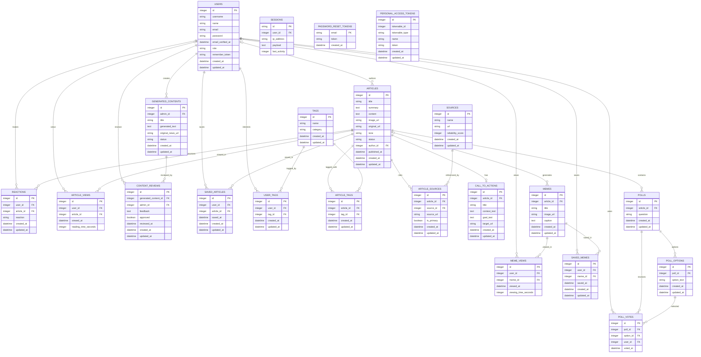

# TLE4 Project Backend

This repository contains the backend for the TLE4 project — a Laravel API-driven application providing articles, polls, memes, reactions, tags and related features.

## Table of Contents

- Project Overview
- ERD (Entity Relationship Diagram)
- Frontend Implementation
- Installation
- Deployment
- Configuration (.env)
- Usage & Testing
- Edge Cases & Decisions

## Project Overview

Impakt is a news platform that delivers news in a lighter, sometimes humorous way to help reduce pessimistic future outlooks among 18–23-year-olds in the Randstad region of the Netherlands, while still keeping them informed about important news.

## ERD (Entity Relationship Diagram)

The following Mermaid ER diagram summarizes the main entities and relationships in the system.



## Frontend Implementation (Routes and fields)

All API routes are prefixed with `/api`.

Use `Authorization: Bearer <token>` for protected routes after login.

### General Endpoints

- `POST /api/login`
    - Required fields: `email`, `password`
    - Optional fields: none in the current API controller
    - Returns: `message`, `user`, and `token`
- `POST /api/logout`
    - Required fields: none
    - Optional fields: none
    - Auth: required
    - Returns: a logout confirmation message


### User endpoints

- `GET /api/home`
    - Required fields: none
    - Optional fields: none
    - Returns: an array of active articles ordered from newest to oldest


### Admin endpoints

- `GET /api/articles`
  - Returns: list of articles (public)
- `GET /api/articles/{article}`
  - Returns: a single article by ID (public)
- `POST /api/articles`
  - Auth bearer token: required (admin)
  - Required fields: typical article fields (e.g. `title`, `summary`, `content`, `image_url`, `original_url`, `tone`, `status`)
  - Returns: the created `Article`
- `PUT /api/articles/{article}`
  - Auth bearer token: required (admin)
  - Replaces an article; accepts same fields as `POST`
- `PATCH /api/articles/{article}`
  - Auth bearer token: required (admin)
  - Partial update of an article
- `DELETE /api/articles/{article}`
  - Auth bearer token: required (admin)
  - Deletes the specified article
- `GET /api/articles/{article}/edit`
  - Auth bearer token: required (admin)
  - Returns article data suitable for editing (admin-only)

  ### backend testing

  - `GET /api/me`
    - Required fields: none
    - Optional fields: none
    - Auth: required
    - Returns: the authenticated `user`

### Frontend flow

- Submit `email` and `password` from the login form.
- Store the returned token securely and send it on protected requests.
- Load the home feed from `/api/home` on first render.
- Use `/api/me` to hydrate the current session after refresh.
- Call `/api/logout` to revoke the current token and clear the local session.

### Article response shape

The `/api/home` endpoint returns `Article` records with fields such as:

- `id`
- `title`
- `summary`
- `content`
- `image_url`
- `original_url`
- `tone`
- `status`
- `author_id`
- `published_at`
- `created_at`
- `updated_at`

## Installation

Prerequisites:

- PHP 8.1+ (match composer.json)
- Composer
- MySQL or Postgres
- Redis (recommended for queues)
- Node.js & npm (if front-end assets are built here)

Quick local setup:

```bash
composer install
cp .env.example .env
php artisan key:generate
# configure DB settings in .env
php artisan migrate --seed
php artisan storage:link
php artisan serve --host=127.0.0.1 --port=8000
```

For queue workers (local dev):

```bash
php artisan queue:work --tries=3
```

## Deployment

General recommendations for production deployment:

- Use a process manager (Supervisor) to run `php artisan queue:work` and `php artisan horizon` if enabled.
- Serve the app behind Nginx with PHP-FPM. Example Nginx location root: `public/`.
- Use environment variables (secure `.env`) and do not commit secrets.
- Run `php artisan migrate --force` as part of deploy.
- Use `php artisan config:cache`, `route:cache`, and `view:cache` for performance.
- Set up scheduled tasks (`php artisan schedule:run`) via cron.

An example minimal supervisor config for queue workers:

```ini
[program:tle4-queue]
process_name=%(program_name)s_%(process_num)02d
command=php /path/to/app/artisan queue:work --sleep=3 --tries=3
autostart=true
autorestart=true
user=www-data
numprocs=1
redirect_stderr=true
stdout_logfile=/var/log/laravel-queue.log
```

## Configuration (.env)

Important variables:

- `APP_ENV`, `APP_DEBUG`, `APP_URL`
- `DB_CONNECTION`, `DB_HOST`, `DB_PORT`, `DB_DATABASE`, `DB_USERNAME`, `DB_PASSWORD`
- `CACHE_DRIVER`, `QUEUE_CONNECTION`, `SESSION_DRIVER`, `SESSION_LIFETIME`
- `MAIL_MAILER` and mail provider credentials
- `SANCTUM_STATEFUL_DOMAINS` / `SESSION_DOMAIN` if using Sanctum for SPA auth

## Usage & Testing

- API routes live under `routes/api.php`.
- Use Postman or HTTP client to exercise endpoints; authentication uses Laravel Sanctum tokens.
- Run automated tests:

```bash
composer test
# or
./vendor/bin/pest
```

## Edge Cases 


